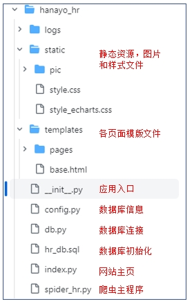
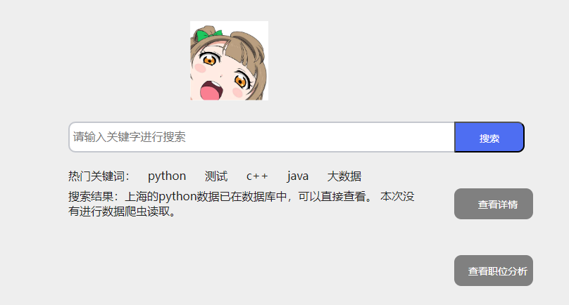
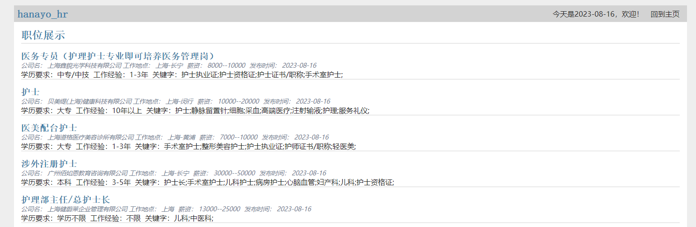
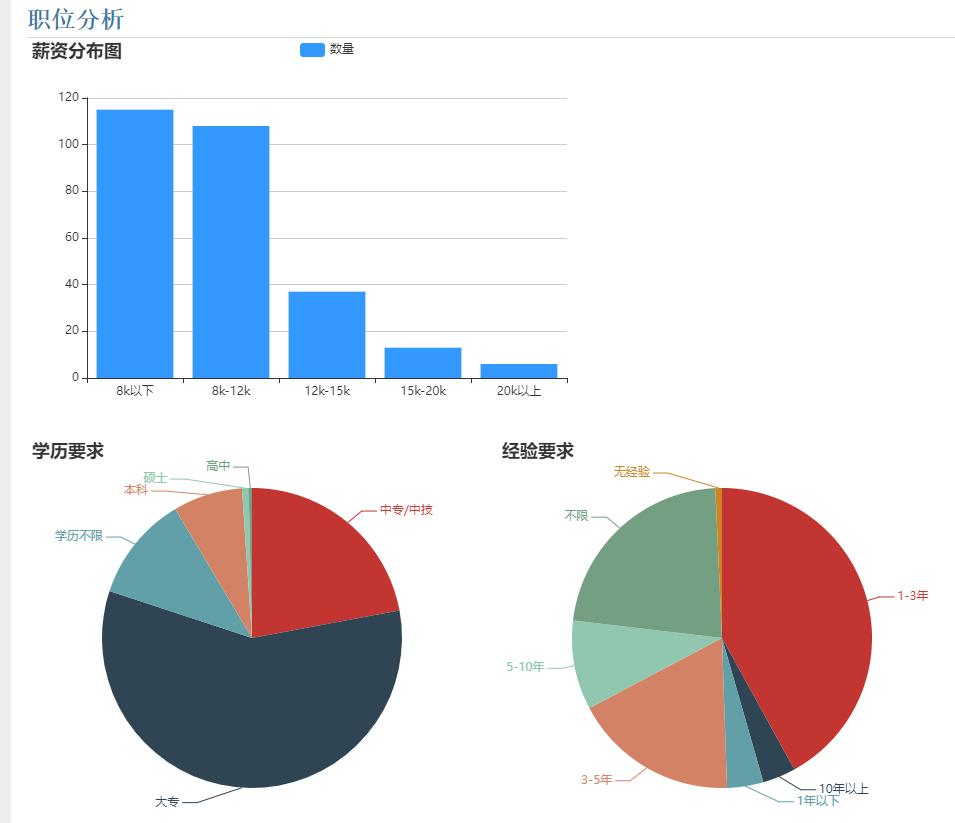

# hanayo_hr
输入关键字，通过招聘网站爬取职位数据（目前默认是上海）。然后通过Flask框架进行展示，通过Echarts显示分析图表。

### 初始化设置

1. 数据库设置：本应用使用Mysql5.7 ，请先连接Mysql，然后运行hr_db.sql中的语句，初始化数据库。
2. 修改数据库信息：请修改congfig.py中的数据库连接参数为自己数据库的连接参数
3. 输入cookie参数：请登录智联招聘，然后复制cookie，更新到congfig.py的cookie中

其他所需库，请见requirements.txt

### 网站结构

见下图



### 运行

请在虚拟环境运行如下命令启动应用：

```python
flask --app hanayo_hr run --debug
```

然后请通过浏览器访问如下链接：

http://127.0.0.1:5000/

## 如何使用

### 输入关键字进行搜索

默认主页如下所示，请在搜索框中输入关键字进行搜索：


1. 如果是之前已经输入过的关键字，将不会进行爬取，可以直接查看结果
    
    
    
2. 如果是新关键字，将会进行爬虫，爬虫完毕后会有提示
    
    
    

### 查看职位详细

在首页点击职位详细后，来到详情页面。这里会分页展示数据，默认每页展示10个。


### 查看职位分析

点击首页的职位分析可以看到如下的职位分析


